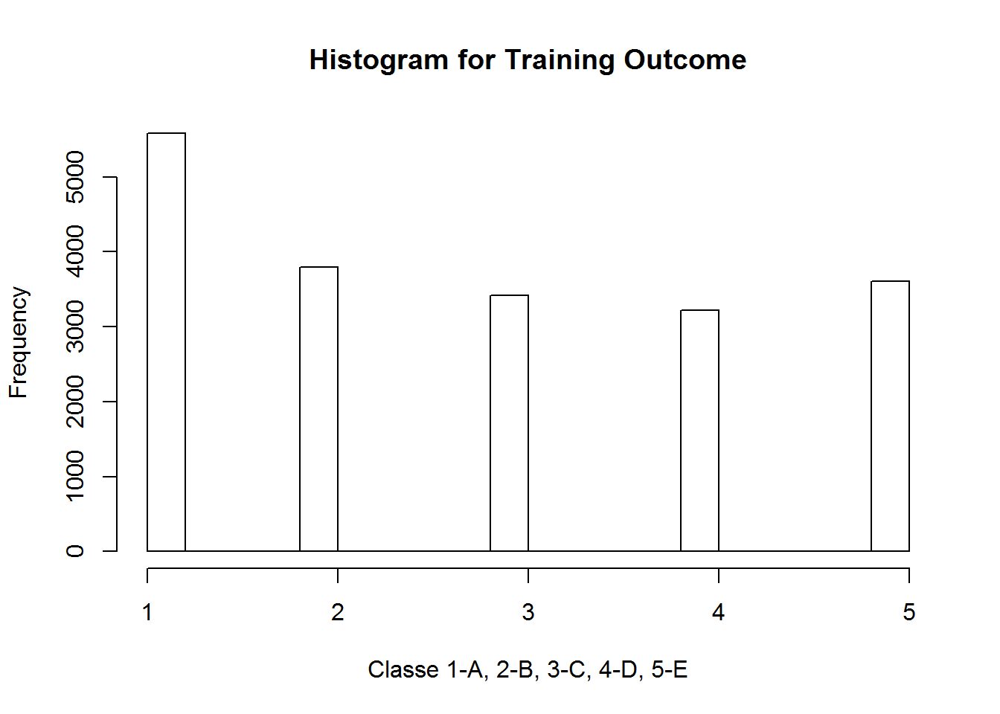

# Practical Machine Learning Project
Happy Data  
Happy Day  
# Purpose of this project

To predicate the outcome of classe Using devices such as Jawbone Up, Nike FuelBand, and Fitbit it is now possible to collect a large amount of data about personal activity relatively inexpensively. These type of devices are part of the quantified self movement - a group of enthusiasts who take measurements about themselves regularly to improve their health, to find patterns in their behavior, or because they are tech geeks. One thing that people regularly do is quantify how much of a particular activity they do, but they rarely quantify how well they do it.
In this project, the goal is to use data from accelerometers on the belt, forearm, arm, and dumbbell of 6 participants. They were asked to perform barbell lifts correctly and incorrectly in 5 different ways. The purpose of this project is to predict the manner, using outcome variable called "classe", in which they did the exercise. This is the "classe" variable in the training set.
 

## Step 1: Get input data 
Download the project first data sets from https://d396qusza40orc.cloudfront.net/predmachlearn/pml-training.csv and the second data set from https://d396qusza40orc.cloudfront.net/predmachlearn/pml-testing.csv in case the internet connection is not always available during research.
 ** The data for this project come from this source: http://groupware.les.inf.puc-rio.br/har. 

Read two data sets into R. Let's look at the data. 

```r
library(caret)
```

```
## Loading required package: lattice
## Loading required package: ggplot2
```

```r
library(rpart) # Regressive Partitioning and Regression trees
library(randomForest) # Random Forest modeling
```

```
## randomForest 4.6-10
## Type rfNews() to see new features/changes/bug fixes.
```

```r
library(e1071)
```


```r
setwd("C:/Users/HQ/Desktop/R4/8_PracticalMachineLearning/Project/New folder")
FirstDataSet <- read.csv("pml-training.csv", header=TRUE, sep=",", 
                         stringsAsFactors=FALSE,na.strings = c("NA", "")) 
SecondDataSet <- read.csv("pml-testing.csv", header=TRUE, sep=",", 
                          stringsAsFactors=FALSE,na.strings = c("NA", "")) 
#names(FirstDataSet)
#names(SecondDataSet)
```
These two datasets are similar except the last column name is different. The training data set is used for model buiding. The testing data set does not have classe varialbe, and is only used for project submittion.

## Step 2: Get to know how outcome column 'classe' is distributed?

```r
hist(as.numeric(as.factor(FirstDataSet$classe)), 
     xlab = "Classe 1-A, 2-B, 3-C, 4-D, 5-E",
     main="Histogram for Training Outcome") 
```

 

It shows classe is distributed into five bins. Per http://groupware.les.inf.puc-rio.br/har, the value of Classe means the following's:

  exactly according to the specification (Class A)

  throwing the elbows to the front (Class B)

  lifting the dumbbell only halfway (Class C) 

  lowering the dumbbell only halfway (Class D) 

  throwing the hips to the front (Class E).


## Step 3: Identify features to use for model building
The properties of good features are

  * Lead to data compression
  
  * Retain relevant information
  
  * Are created based on expert application knowledge
  
To identify featured columns as predictors for Outcome Classe:

  a. remove NA columns as they have no impact to Classe to compress the data. Process the same on both first and second data sets.

```r
NAs <- apply(FirstDataSet, 2, function(x) {
    sum(is.na(x))
})
FirstDataSetWoutNA <- FirstDataSet[, which(NAs == 0)]
SecondDataSetWoutNA <- SecondDataSet[, which(NAs == 0)]
```

  b. Remove columns has no signficate impact to outcome Classe to compress the data as well.

```r
FirstDataSetWoutZero <- FirstDataSetWoutNA[,-nearZeroVar(FirstDataSetWoutNA)]
SecondDataSetWoutZero <- SecondDataSetWoutNA[,-nearZeroVar(SecondDataSetWoutNA)]
#names(FirstDataSetWoutZero)
```
 c. Remove index column and other not relavent to the outcome classe
 
They are columns "X", "user_name","raw_timestamp_part_1","raw_timestamp_part_2", "cvtd_timestamp","num_window".


```r
FirstDataSetWoutUnRelvant<- FirstDataSetWoutZero[,-c(1:6)]
SecondDataSetWoutUnRelvant<- SecondDataSetWoutZero[,-c(1:6)] # this set will be used for problem submission
dim(FirstDataSet)
```

```
## [1] 19622   160
```

```r
dim(FirstDataSetWoutUnRelvant)
```

```
## [1] 19622    53
```
 Total of 32% columns left for model processing, so the process performance will be improved. 

## Step 4: Develop the first algorithms 
The following guide line is used for developing model algorithm:

1.	Define error rate: 80% Accuracy which weights false positives/negatives equally. The reason for selecting Accuracy to measure error rate is because classe is a categorical outcome. The Fraction correct rate is measured.

2. Split data into training and testing sets
Consider the size of data is relative small, cross reference is needed by training and testing data sets.
Partition the data into three data sets: training, validating and testing.

```r
set.seed(200)
indexTree <- createDataPartition(y =FirstDataSetWoutUnRelvant$classe, p = 0.75, list = FALSE)
Training <- FirstDataSetWoutUnRelvant[indexTree, ]  # 11776 records in training set
Testing  <- FirstDataSetWoutUnRelvant[-indexTree, ] # 4904 records in testing set for cross validation
dim(Training)
```

```
## [1] 14718    53
```

```r
dim(Testing)
```

```
## [1] 4904   53
```

3. On the training set, pick prediction function which uses Tree model


```r
TreeModel <- rpart(classe ~ ., data=Training, method="class")
```

4. Apply model once to test set

```r
TreePredicting <- predict(TreeModel, Testing, type = "class")
```
5. Compare the actual value with predicted value using Testing data set

```r
TreeResult<-confusionMatrix(TreePredicting, Testing$classe)
```

## Step 5: Develop the second algorithms 


```r
RandomForestModel <- randomForest(as.factor(classe) ~. , data=Training, method="class") 
RandomForestPredicting <- predict(RandomForestModel, Testing, type = "class")
RadomForestResult<-confusionMatrix(RandomForestPredicting, Testing$classe)
```

## Step 6: Compare two models and estimate model error

```r
print(TreeResult$table)
```

```
##           Reference
## Prediction    A    B    C    D    E
##          A 1264  146   20   30   13
##          B   57  585   80   79   81
##          C   43   95  670  116  100
##          D   15   73   65  523   50
##          E   16   50   20   56  657
```

```r
print(RadomForestResult$table) 
```

```
##           Reference
## Prediction    A    B    C    D    E
##          A 1394    3    0    0    0
##          B    0  946    3    0    0
##          C    1    0  852    5    0
##          D    0    0    0  797    1
##          E    0    0    0    2  900
```
Prediction compare above shows that the Radom Forest method predict more accurate values for the outcome. For example, comparing in the number (row A, column B) in the two tables above, decision tree has 146 predicated value does not match with actual, but Random Forest model (row A, column B) has 3 only.


```r
print(TreeResult$overall)
```

```
##       Accuracy          Kappa  AccuracyLower  AccuracyUpper   AccuracyNull 
##   7.542822e-01   6.886266e-01   7.419818e-01   7.662792e-01   2.844617e-01 
## AccuracyPValue  McnemarPValue 
##   0.000000e+00   5.561924e-23
```

```r
print(RadomForestResult$overall)
```

```
##       Accuracy          Kappa  AccuracyLower  AccuracyUpper   AccuracyNull 
##      0.9969413      0.9961308      0.9949601      0.9982871      0.2844617 
## AccuracyPValue  McnemarPValue 
##      0.0000000            NaN
```
The accuracy from Random Forest model is 99% which is higher than 75% (lower than 80%) from Desion Tree.


```r
print(TreeResult$byClass)
print(RadomForestResult$byClass)
```

#Summary
All of the above results show that the Random Forest model predicates more accurate than decision tree model. So, the Random Forest model is selected to submit the result for the 20 rows of testing data. 

